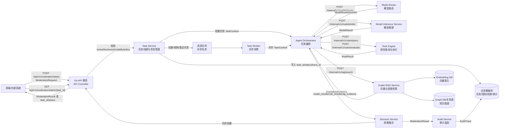

# 02-系统架构设计

## 1. 文档口径

本文档描述 Agent Censor 的目标系统架构。当前仓库仅包含早期目录骨架，后续实现应在现有目录基础上逐步落地。

## 2. 总体架构

目标系统采用分层架构：

1. 前端层：审核工作台、策略配置、结果解释、人工复核、项目进度展示。
2. API 服务层：建议使用 Go 后端服务，提供任务提交、结果查询、规则维护、标签查询接口。
3. 规则引擎层：管理规则、阈值、策略版本、处置动作和规则命中结果。
4. 智能体层：按标签树组织 sub-agent，进行任务编排、工具/skill 调用、连续对话、Graph RAG 检索和解释生成。
5. 模型层：提供文本、图片、视频、音频等多模态审核模型和模型路由。
6. RAG 层：提供向量检索、知识图谱检索和证据摘要。
7. 数据层：管理数据集、爬虫数据、标注数据、RAG 知识、审计日志。
8. 数据库层：存储业务配置、规则、审核任务、审核结果、embedding、图谱关系和审计轨迹。

## 3. 目录映射

| 目录 | 目标职责 |
| --- | --- |
| `frontend` | 前端审核工作台、策略配置、证据展示和人工复核 |
| `backend` | Go API 服务、鉴权、任务管理、规则管理、结果查询 |
| `core/agent` | 树型智能体编排、工具调用、连续对话、Graph RAG 解释 |
| `core/model` | 多模态模型、模型路由、模型服务封装 |
| `data` | 数据集、爬虫数据、RAG 知识库、标注数据 |
| `db` | 业务数据库、embedding 数据库、图谱数据库或关系表 |
| `script` | 爬虫脚本、清洗脚本、训练脚本、评估脚本 |
| `test` | API、规则、模型、并发、端到端测试 |
| `out` | 报告、评估结果、导出演示材料 |

## 4. 核心数据流

实际审核链路分为同步轻量链路和异步任务链路。文本、单图等轻量任务优先走同步链路，目标是在 3 秒内向前端返回可展示结果；批量审核、视频、大文件、模型超时重试和离线评估任务进入消息队列异步处理。

同步与异步边界：

- 同步路径：`ModerationRequest` 校验通过后，API 服务创建 `task_id` 和 `trace_id`，将 `TaskContext` 交给智能体编排，依次完成模型路由、模型推理、规则执行、Graph RAG 检索、结果融合和审计写入，然后返回 `ModerationResult`。
- 异步路径：批量、视频、大文件、失败重试和离线评估任务先返回 `task_id`、`status` 和 `trace_id`，任务 Worker 消费队列后复用同一套智能体、模型、规则、RAG、决策和审计链路，前端通过查询接口获取最终结果。
- 降级路径：模型、规则或 RAG 超时时，智能体应记录错误和降级信息；如存在 fallback 模型或缓存结果，仍生成可解释的降级版 `ModerationResult`，并在 `AuditTrace` 中保留原因。

数据对象流转表：

| 阶段 | 主要输入 | 主要输出 | 说明 |
| --- | --- | --- | --- |
| 前端/外部系统 -> API 服务 | `ModerationRequest` | `task_id`、`status` 或 `ModerationResult` | 对外入口，携带 `tenant_id`、`business_id`、`modality`、`policy_id`、`trace_id`。 |
| API 服务 -> Task Service | `ModerationRequest` | `TaskContext` | 完成鉴权、租户业务校验、内容格式校验和任务状态初始化。 |
| Task Service -> 消息队列 | `TaskContext` | 异步任务消息 | 仅批量、视频、大文件、重试和离线任务进入队列。 |
| Agent Orchestrator -> Model Router | `TaskContext`、内容特征 | `ModelRouteDecision` | 根据模态、业务、策略和模型可用性选择主模型与 fallback。 |
| Agent Orchestrator -> Model Inference Service | `ModelInferenceRequest` | `ModelResult` | 返回标签、分数、模型版本、证据和模型耗时。 |
| Agent Orchestrator -> Rule Engine | `RuleEvaluationRequest` | `RuleResult` | 根据策略版本、模型结果和 RAG 证据执行规则。 |
| Agent Orchestrator -> Graph RAG Service | `GraphRagSearchRequest` | `GraphRagEvidence` | 返回命中节点、关系路径、相似度或置信度、证据摘要。 |
| Decision Service | `ModelResult`、`RuleResult`、`GraphRagEvidence` | `ModerationResult` | 融合模型、规则和 RAG 证据，形成最终结论和解释。 |
| Audit Service -> 数据库 | 请求快照、模型结果、规则结果、RAG 证据、最终结果 | `AuditTrace` | 记录全链路输入、输出、错误、降级和人工复核动作。 |

## 5. 前端架构目标

前端应覆盖 `NOTE.md` 中“前端、策略设计合理、实现效果好”的要求。建议实现以下模块：

- 审核队列：展示任务状态、风险等级、业务、模态、提交时间。
- 结果面板：3 秒内呈现审核结果，展示 `decision`、`risk_score`、`labels` 和 `suggested_action`。
- 证据面板：高亮文本证据、图片检测框、视频时间段、RAG 证据路径。
- 策略面板：可视化规则、阈值、处置动作，支持策略版本查看。
- 复核面板：支持一键通过、打回、改标、备注，并写入审计。
- 预览面板：调整阈值后预览审核结论变化。

## 6. 后端架构目标

后端建议使用 Go 服务实现，职责包括：

- 提供 REST API。
- 管理租户、业务、策略版本和任务状态。
- 编排规则引擎、智能体、模型服务和 RAG 服务。
- 统一生成 `ModerationResult` 和 `AuditTrace`。
- 提供限流、队列、重试、熔断和降级能力。

## 7. 规则引擎架构目标

规则引擎应支持配置化和可视化管理：

- 规则按 `tenant_id`、`business_id`、`modality`、`policy_id`、`version` 生效。
- 条件支持关键词、正则、模型分数阈值、标签组合、RAG 命中节点。
- 处置动作支持 `pass`、`review`、`reject`、`pass_with_limit`。
- 输出规则命中原因、证据片段和最终动作建议。

## 8. 智能体与模型架构目标

智能体负责任务编排而不是替代规则引擎：

- 后续实现应按 `config/settings.json` 的 `rules` 字段构建标签树，`rules.security` 映射为 `SECURITY`，`rules.ecosystem` 映射为 `ECOSYSTEM`。
- 智能体采用树型 sub-agent 组织：RootAgent 调用 `SecurityAgent` 和 `EcosystemAgent`，中间智能体继续调用子智能体，叶子智能体负责最小标签判断。
- 叶子智能体返回 `{ "label": "...", "reason": "..." }`；中间智能体返回 `{ "label": ["..."], "reason": "..." }`；顶级智能体返回 `{ "security_labels": ["..."], "ecosystem_labels": ["..."], "reason": "..." }`。
- 父智能体不得修改、添加、删除收集到的子智能体标签，只能综合子智能体的 `reason`。
- 根据任务类型调用模型路由。
- 根据规则命中结果调用 Graph RAG。
- 根据历史上下文支持连续追问和策略解释。
- 根据工具/skill 输出形成可解释摘要。

模型层应按模态拆分：

- 文本审核模型。
- 图片审核模型。
- 视频抽帧和时序审核模型。
- 音频转写和音频风险审核模型。
- fallback 模型，用于主模型不可用时降级。

## 9. Graph RAG 架构目标

Graph RAG 应同时保留向量检索和图谱关系：

- 向量库用于语义召回政策条款、案例和规则说明。
- 图谱用于表达标签、政策、案例、规则、样本之间的关系。
- 检索结果返回命中节点、关系路径、相似度或置信度、证据摘要。
- 审核解释应说明“为什么命中该标签”和“依据哪些政策或案例”。

## 10. 高并发与自动化

目标架构应支持高并发和自动化：

- API 层使用限流、任务队列和批量接口。
- 模型层使用批处理、异步推理和缓存。
- 规则和 RAG 层使用配置缓存和检索结果缓存。
- 自动化流程覆盖数据采集、清洗、训练、评估、部署、监控和告警。

## 11. 内部服务通信拓扑

内部服务通信拓扑应与第 4 节数据流保持一致。后续实现建议默认使用 HTTP/JSON，同步调用统一走 `/internal/v1` 前缀；批量审核、长耗时模型推理、失败重试和离线评估任务使用任务队列异步处理。

建议拓扑：

1. 前端或外部系统调用 Go API 服务的 `/api/v1` 对外接口。
2. Go API 服务完成鉴权、租户、业务、模态和策略校验，创建 `task_id`、`trace_id` 和任务状态。
3. Task Service 判断同步或异步：轻量任务直接调用智能体；批量、视频、大文件和重试任务写入消息队列。
4. 智能体通过内部 HTTP 调用模型路由、模型推理、规则查询、规则执行和 Graph RAG 检索服务。
5. 模型服务返回标准化 `ModelResult`，规则引擎消费该结构执行 `model_score` 等条件。
6. Graph RAG 服务访问 embedding 数据库和图谱数据库，返回命中节点、关系路径、相似度或置信度和证据摘要。
7. Decision Service 将模型、规则、RAG 结果合成为 `ModerationResult`。
8. Audit Service 写入 `AuditTrace`，记录请求、路由、模型、规则、RAG、树型智能体各级返回、最终结果、错误、降级和人工处置。
9. 同步任务由 API 服务直接返回 `ModerationResult`；异步任务由前端通过 `GET /api/v1/moderation/tasks/{task_id}` 查询状态和结果。

通信约束：

- 所有内部调用必须携带 `trace_id`，并在任务创建后携带 `task_id`、`tenant_id`、`business_id`、`policy_id`；涉及模态或策略版本判断的调用还必须携带 `modality` 和 `policy_version`。
- 轻量规则查询、规则执行、Graph RAG 检索默认同步返回。
- 批量审核、视频模型推理、大文件处理和重试任务进入消息队列。
- 任务状态、审核结果和审计轨迹必须共享同一个 `trace_id`，用于验收演示、问题复盘和连续对话上下文查询。
- HTTP/JSON 是早期实现默认方案；如后续需要更强类型约束或更低延迟，可将模型和规则内部接口平滑替换为 gRPC。
